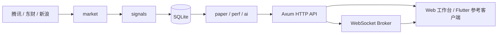

# 架构说明

## 组件

- `market.rs`：行情请求、解析和来源优先级。
- `signals.rs`：技术指标与信号因子。
- `paper.rs`：模拟订单、成交、费用、T+1、估值和权益快照。
- `perf.rs`：信号未来收益回填及聚合。
- `ai.rs`：五角色提供者接口、本地启发式实现和加权仲裁。
- `universe.rs`：自选组和指数池。
- `ws.rs`：进程内主题订阅与广播。
- `routes.rs`：HTTP 接口组合与响应结构。

## 数据与一致性

SQLite 使用 WAL、外键和 5 秒 busy timeout。`AppState` 当前持有单连接互斥锁，适合单进程家庭部署。订单冻结、成交、撤单、估值标记和快照均在事务中更新。持仓快照只有在全部股票取得有效行情后才提交。

## 网络边界

服务本身没有身份验证。Docker Compose 默认把端口绑定到宿主机 loopback。跨设备访问应放在可信私有网络或带认证的反向代理之后。

## AI 边界

当前五个角色都是本地确定性启发式提供者，不调用外部大模型。`ModelProvider` trait 是远程模型或本地推理服务的扩展点。未来实现必须处理超时、结构化输出校验、费用统计、敏感数据最小化与降级策略。

## 扩展方向

- 独立、按版本递增的数据库迁移文件；
- 交易所日历和停牌规则；
- 定时扫描、快照和后验任务；
- API 身份验证与多账户隔离；
- 行情缓存、来源健康度和熔断；
- 完整 Flutter/Tauri 工程及自动发布。
