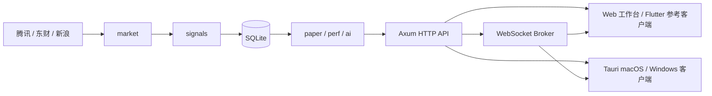

# 架构说明

## 组件

桌面客户端复用 Web 工作台，并由系统 WebView 渲染。Tauri 原生层目前只负责窗口和安装包，不开放文件系统、Shell 或任意原生命令。`mj-server` 独立运行，因此客户端可连接本机或家庭网络中的服务实例。

- `market.rs`：行情请求、解析和来源优先级。
- `signals.rs`：技术指标与信号因子。
- `paper.rs`：模拟订单、成交、费用、T+1、估值和权益快照。
- `perf.rs`：信号未来收益回填及聚合。
- `research.rs`：新闻 RSS、昨日美股和 A 股行业板块上下文采集。
- `ai.rs`：五角色 OpenAI 兼容提供者、本地逐路降级、历史后验证据、加权仲裁和风险预算计划。
- `universe.rs`：自选组和指数池。
- `ws.rs`：进程内主题订阅与广播。
- `routes.rs`：HTTP 接口组合与响应结构。

## 数据与一致性

SQLite 使用 WAL、外键和 5 秒 busy timeout。`AppState` 当前持有单连接互斥锁，适合单进程家庭部署。订单冻结、成交、撤单、估值标记和快照均在事务中更新。持仓快照只有在全部股票取得有效行情后才提交。

## 网络边界

服务本身没有身份验证。Docker Compose 默认把端口绑定到宿主机 loopback。跨设备访问应放在可信私有网络或带认证的反向代理之后。

## AI 边界

设置 `MJ_AI_API_KEY` 后，五个角色通过 OpenAI 兼容接口并行调用，可为每个角色指定不同模型。服务端校验结构化输出、限制超时并在单路失败时回退到本地启发式。未配置 Token 时不会向模型服务发送数据。

## 扩展方向

- 独立、按版本递增的数据库迁移文件；
- 交易所日历和停牌规则；
- 定时扫描、快照和后验任务；
- API 身份验证与多账户隔离；
- 行情缓存、来源健康度和熔断；
- Flutter 完整平台工程、桌面端内置后端及签名发布。
